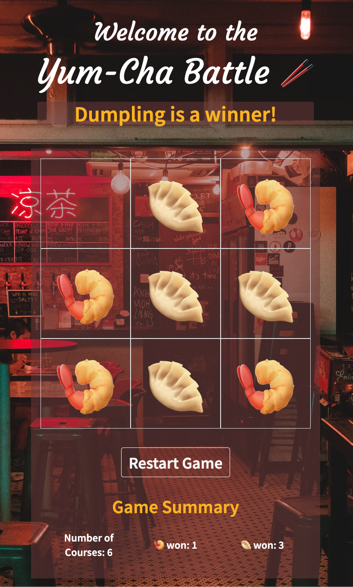
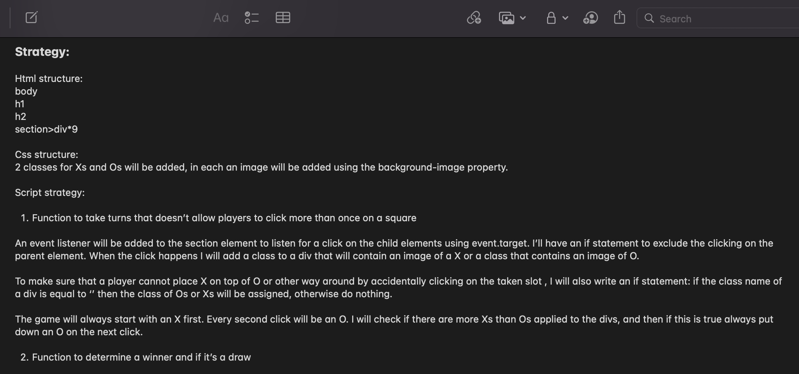
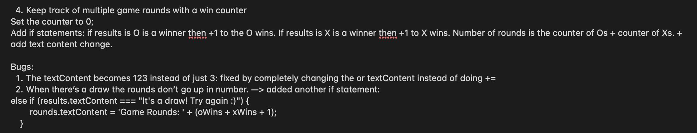

# Tic Tac Toe
A game of Tic Tac Toe in Yum Cha style.
## :computer: [Click here](https://yablony.github.io/tic_tac_toe/) to play the game!
## :page_facing_up: About
**How to play:**
1. Get a friend and take turns putting :fried_shrimp: and :dumpling: on the Tic Tac Toe 3x3 grid.
2. Once the game is over you'll know the winner of the round or if it's a draw.
3. Use the 'Restart Game' button to start a new round.
4. The game will keep count of the game rounds (number of courses), as well as your wins.
5. Have fun with it!  

## :pencil2: Planning & Problem Solving
I started off by dotting down the key requirements of the MVP that I'll have to meet, which were then integrated into a plan:
1. Render a game in the browser
2. Switch turns between more than one player.
3. Design logic for winning & visually display which player won.
4. Use Javascript (JS) for DOM manipulation.

To meet the requirements of the MVP I had to write three separate files for HTML, CSS and JS. The major stages of ther project were written out as below:
1. Write two headings and establish 9 divs for the future Tic Tac Toe squares inthe HTML file.
2. Edit the CSS file to organise the divs in a 3x3 grid.
3. In the JS create a function to take turns that doesn’t allow players click more than once on a grid's square.
4. Still in JS write if statements to determine a winner and if it’s a draw.

After writing out exactly how I would achieve each of the above I was able to go forward and start writing my code, testing the code and fixing any bugs that came up along the way.

### :sunglasses: Post-MVP
After the MVP was delivered with the remaining time I decided to add more features to the game to make it more user-friendly: 
1. A button that resets the game.
2. A game tracker that will count game rounds and the players' wins. 

I also played around with the CSS by adding a background image, replacing the original images of crosses and noughts with fried shrimps and dumplings, and addinf some animations for fun.

## :rocket: Cool tech
- JS, HTML, CSS, DOM manipulation;
- Libraries: Animate.css, Bootstrap;
- Animation: change in the color of the 'game name', animation on the shrimp and dumpling with the help of Animate.css;
- Added emojis in CSS and HTML for the shrimp and dumpling instead of images.

## :scream: Bugs to fix :poop:
- Website needs to be adjusted for screens of other sizes, e.g. the mobile interface.

## :sob: Lessons learnt
- Planning is important for the wellbeing of the code, as well as my mental wellbeing.
- Get different people to test the game ahead of the deadline to find unnoticed bugs.

## :white_check_mark: Future features
- A feature that allows a player to enter their name.
- A feature that allows to pick a Yum-Cha food to play with instead of only fried shrimp and dumpling.
- Sound effects for game immersion: player clicks and background music.
- An option to play against the computer with different levels of difficulty.
